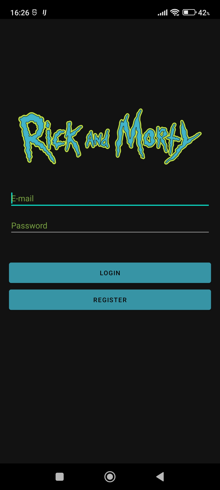
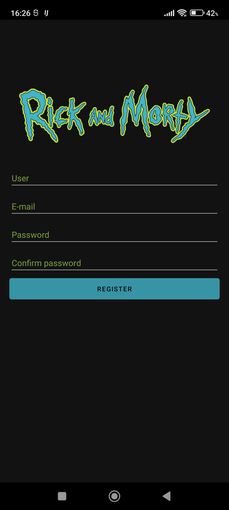
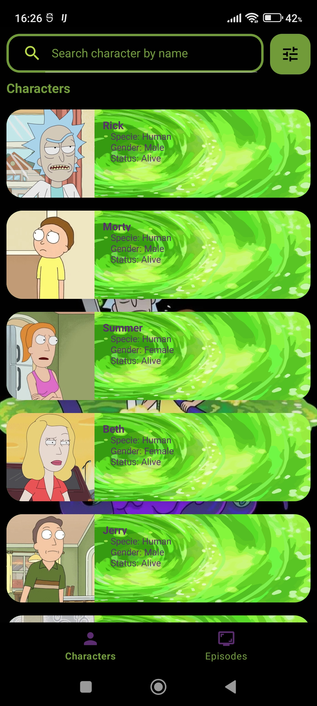

# Rick And Morty API - MVVM - HILT - ROOM

  

  
Application to practice the consume of <b>API'S</b>, in this case the API of <b>Rick & Morty</b>

  
  

    
    
    
  

# Technologies used in this app
- Presentation architecture -> MVVM
- Architecture -> Clean
- Json Converter -> Gson
- HTTP Client -> Retrofit2
- Firebase -> Auth & Crashlytics
- Database -> Room
- Dependency injection -> Dagger Hilt
- Unit Testing -> Mockito

# Credits
- [The Rick and Morty API](https://developers.themoviedb.org/3/getting-started/introduction)
